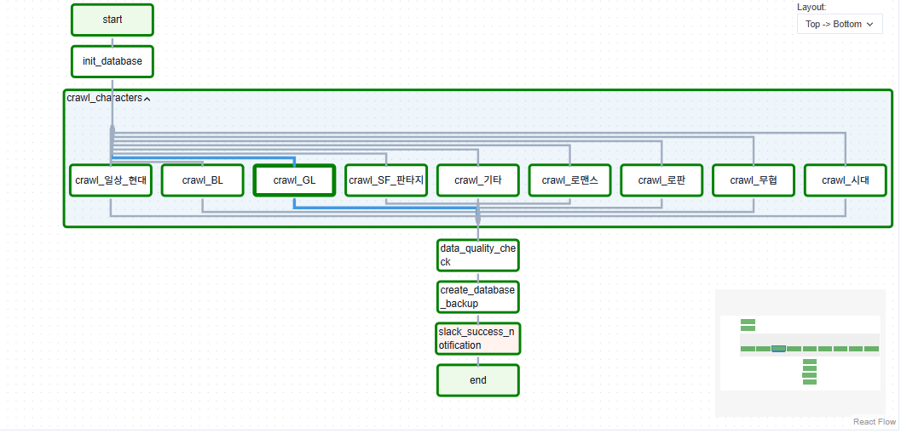
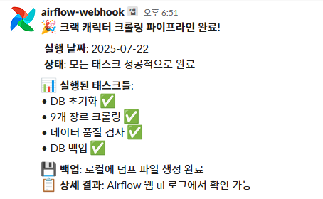

# CRACK Character Crawler Pipeline

CRACK(크랙) 캐릭터 정보를 수집하고 관리하는 Airflow 기반 데이터 파이프라인

## 과제 개요

WRTN AI의 CRACK 서비스에서 제공하는 캐릭터 정보를 자동으로 수집하여 PostgreSQL 데이터베이스에 저장하고, 데이터 품질 검사 및 백업을 수행하는 완전 자동화된 데이터 파이프라인 구축

### 주요 기능
-  **자동 데이터 수집**: 9개 장르별 캐릭터 정보 크롤링 (로맨스, BL, 무협, 시대, 일상/현대, 기타, SF/판타지, 로판, GL)
-  **병렬 처리**: Docker 기반 장르별 동시 크롤링으로 성능 최적화
-  **데이터 품질 관리**: 수집된 데이터의 무결성 및 완성도 자동 검증
-  **자동 백업**: 일일 PostgreSQL 데이터베이스 덤프 생성
-  **Slack 알림**: 파이프라인 실행 결과 실시간 알림

## 실행 방법

### 사전 요구사항
- Docker 및 Docker Compose 설치 필요

### 1. 레포지토리 클론
```bash
git clone <repo-url>
cd rt-project
```

### 2. Docker 컨테이너 실행
```bash
# docker 폴더로 이동
cd docker

# 컨테이너 빌드 및 실행
docker compose up --build -d
```

### 3. Airflow Variables 설정
Airflow 웹 UI에서 다음 Variables를 설정해야 합니다:

| Variable 이름 | 설명 | 예시 값 |
|---------------|------|---------|
| `crack_db_host` | PostgreSQL 호스트 | `crack-postgres` |
| `crack_db_name` | 데이터베이스 이름 | `crack_db` |
| `crack_db_user` | 데이터베이스 사용자 | `airflow` |
| `crack_db_password` | 데이터베이스 비밀번호 | `airflow` |
| `crack_db_port` | 데이터베이스 포트 | `5432` |
| `slack_webhook_url` | Slack 웹훅 URL | `https://hooks.slack.com/...` |

#### CLI로 Variables 설정하는법
```bash
# Airflow 컨테이너 접속
docker exec -it docker-airflow-webserver-1 bash

# Variables 설정 (슬랙은 본인 워크스페이스 웹 훅 등록)
airflow variables set crack_db_host "crack-postgres"
airflow variables set crack_db_name "crack_db"
airflow variables set crack_db_user "airflow"
airflow variables set crack_db_password "airflow"
airflow variables set crack_db_port "5432"
airflow variables set slack_webhook_url "https://hooks.slack.com/services/YOUR/SLACK/WEBHOOK"
```

### 4. 파이프라인 실행
1. **Airflow UI 접속**: http://localhost:8080
   - ID/PW: `airflow` / `airflow`

2. **DAG 활성화**:
   - `crack_crawler_pipeline` DAG를 찾아 활성화

3. **수동 실행**:
   - DAG 우측의 ▶️ (Trigger DAG) 버튼 클릭

## 🏗️ 시스템 아키텍처

### 프로젝트 구조
```
rt-project/
├── docker/                        # Docker 관련 파일
│   ├── docker-compose.yml        # Docker Compose 설정
│   └── Dockerfile                # 커스텀 Airflow 이미지
├── dags/                          # Airflow DAG 파일
│   └── crack_pipeline_dag.py     # 메인 크롤링 파이프라인
├── src/rt_project/                # 소스 코드
│   ├── crawlers/
│   │   └── crack_crawler.py      # 캐릭터 크롤러 (Click CLI)
│   └── utils/
│       ├── dag_utils.py          # 데이터 품질 검사 유틸리티
│       └── slack_utils.py        # Slack 알림 기능
├── sql/
│   └── init.sql                  # PostgreSQL 초기화 스크립트
├── data/dumps/                   # DB 백업 파일 저장소
└── README.md
```

### 데이터베이스 스키마


```sql
-- 캐릭터 카테고리 (장르)
CREATE TABLE character_categories (
    id SERIAL PRIMARY KEY,
    category_name VARCHAR(50) NOT NULL UNIQUE,
    category_code VARCHAR(50) NOT NULL UNIQUE
);

-- 캐릭터 정보
CREATE TABLE characters (
    id SERIAL PRIMARY KEY,
    character_name VARCHAR(255) NOT NULL,
    category_id INTEGER REFERENCES character_categories(id),
    character_description TEXT,
    target_audience VARCHAR(20),
    chat_type VARCHAR(50),
    tags TEXT[],
    character_image_url TEXT,
    initial_message TEXT,
    creator_nickname VARCHAR(100),
    collected_at TIMESTAMP DEFAULT CURRENT_TIMESTAMP,
    UNIQUE(character_name, category_id)
);
```

## 🔄 DAG 워크플로우




### 실행 순서
1. **Start** → **DB 초기화** (`init_database`)
2. **병렬 크롤링** (`crawl_characters` TaskGroup)
   - 9개 장르 동시 크롤링 (각 장르당 20개 캐릭터)
   - Docker 컨테이너별 독립 실행
3. **데이터 품질 검사** (`data_quality_check`)
   - 수집 개수 검증 (예상: 180개)
   - 필수 필드 누락 체크
   - 장르별 분포 확인
4. **데이터베이스 백업** (`create_database_backup`)
   - PostgreSQL pg_dump 실행
   - 로컬 폴더에 `.sql` 파일 저장
5. **성공 알림** (`slack_success_notification`)
   - Slack 채널로 완료 메시지 발송

   
   
6. **End**

### 주요 특징
- **배치 처리**: 각 장르별 20개씩 한 번에 DB 삽입
- **중복 방지**: `ON CONFLICT DO NOTHING` 정책
- **에러 핸들링**: 개별 장르 실패 시에도 다른 장르는 계속 진행
- **모니터링**: 각 단계별 상세 로그 및 Slack 알림

## 수집 데이터 명세

### API 엔드포인트
- **Base URL**: `https://contents-api.wrtn.ai/character/characters`
- **Parameters**:
  - `sort`: `likeCount.desc` (좋아요 순 정렬)
  - `genreId`: 장르별 고유 ID
  - `limit`: 수집 개수 (기본값: 20)

### 수집 대상 장르
| 장르명 | 장르 ID | 설명 |
|--------|---------|------|
| 로맨스 | 6825b1fb571e3f0f05c87764 | 로맨스 장르 |
| BL | 6825b1fb571e3f0f05c87770 | Boys' Love |
| 무협 | 6825b1fb571e3f0f05c8776c | 무협 소설 |
| 시대 | 6825b1fb571e3f0f05c8776e | 시대극 |
| 일상/현대 | 6825b1fb571e3f0f05c8776a | 현대 일상 |
| 기타 | 6825b1fb571e3f0f05c87772 | 기타 장르 |
| SF/판타지 | 6825b1fb571e3f0f05c87768 | SF 및 판타지 |
| 로판 | 6825b1fb571e3f0f05c87766 | 로맨스 판타지 |
| GL | 68513a5b81ebec8d5406cabc | Girls' Love |

